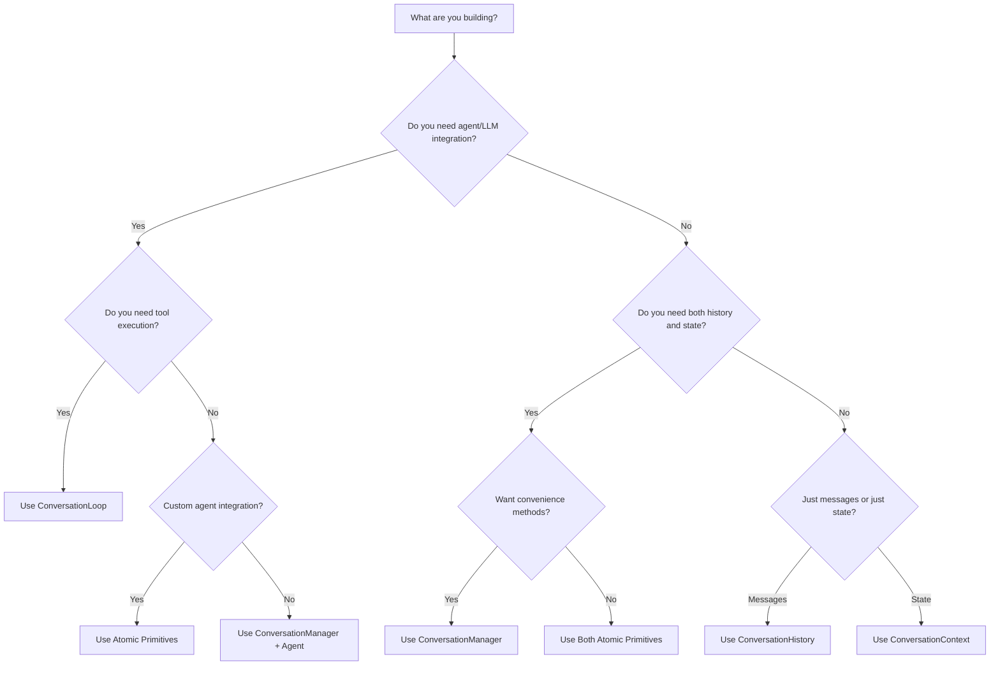

# Choosing the Right Primitive

This guide helps you decide which Grid primitives to use based on your specific needs and use case.

## Quick Decision Tree



## Detailed Comparison

### Atomic Primitives

#### ConversationHistory
**Use when you need:**
- ✅ Just message storage
- ✅ Simple chat logging
- ✅ Audit trails
- ✅ Maximum flexibility

**Best for:**
- Logging systems
- Simple chatbots
- Message archives
- Custom implementations

```typescript
const history = createConversationHistory();
// Perfect for simple message tracking
```

#### ConversationContext
**Use when you need:**
- ✅ Just state management
- ✅ User preferences storage
- ✅ Session tracking
- ✅ Analytics/metrics

**Best for:**
- State machines
- User preference systems
- Analytics tracking
- Session management

```typescript
const context = createConversationContext();
// Ideal for managing conversation state
```

### Composed Layer

#### ConversationManager
**Use when you need:**
- ✅ Both history AND context
- ✅ Convenience methods
- ✅ Unified interface
- ✅ No agent integration yet

**Best for:**
- Standard chat applications
- Customer support systems
- Multi-modal conversations
- Prototyping

```typescript
const manager = createConversationManager();
// Combines both primitives with helpful methods
```

### Organism Layer

#### ConversationLoop
**Use when you need:**
- ✅ Full agent integration
- ✅ Automatic tool handling
- ✅ Progress tracking
- ✅ Lifecycle management

**Best for:**
- Production AI applications
- Complex workflows
- Tool-enabled agents
- Real-time systems

```typescript
const loop = createConversationLoop({ agent });
// Complete solution with agent orchestration
```

## Use Case Examples

### Use Case 1: Simple Chatbot

**Requirements:**
- Store conversation history
- No complex state needed
- No AI/LLM integration

**Recommendation:** Use `ConversationHistory` only

```typescript
const history = createConversationHistory(
  "Welcome to our support chat!"
);

async function handleMessage(userMsg: string) {
  await history.addMessage({ role: "user", content: userMsg });
  
  const response = getSimpleResponse(userMsg);
  await history.addMessage({ role: "assistant", content: response });
}
```

### Use Case 2: Stateful Form Flow

**Requirements:**
- Track user progress
- Store form data
- No conversation history needed

**Recommendation:** Use `ConversationContext` only

```typescript
const context = createConversationContext();

async function handleFormStep(field: string, value: any) {
  await context.updateState(`form.${field}`, value);
  
  const progress = calculateProgress(context.getState());
  await context.updateMetadata('progress', progress);
}
```

### Use Case 3: Customer Support System

**Requirements:**
- Full conversation history
- Track ticket status
- Store customer info
- No AI agent (human agents)

**Recommendation:** Use `ConversationManager`

```typescript
const manager = createConversationManager();

// Track conversation and ticket state together
await manager.addUserMessage("I need help with my order");
await manager.updateState("ticket.status", "open");
await manager.updateState("ticket.priority", "high");
```

### Use Case 4: AI-Powered Assistant

**Requirements:**
- LLM integration
- Tool execution
- Full conversation tracking
- Real-time updates

**Recommendation:** Use `ConversationLoop`

```typescript
const loop = createConversationLoop({
  agent: myAgent,
  toolExecutor: executor,
  onProgress: (update) => sendToWebSocket(update)
});

const response = await loop.sendMessage("Help me plan a trip");
```

### Use Case 5: Custom Analytics System

**Requirements:**
- Track specific metrics
- Custom state structure
- Separate from main conversation
- Complex calculations

**Recommendation:** Use atomic primitives with custom logic

```typescript
// Main conversation
const conversation = createConversationManager();

// Separate analytics tracking
const analyticsHistory = createConversationHistory();
const analyticsContext = createConversationContext();

class AnalyticsTracker {
  async trackInteraction(input: string, output: string) {
    // Custom analytics logic
    const sentiment = analyzeSentiment(input);
    const topics = extractTopics(input);
    
    await analyticsContext.updateStates({
      'metrics.sentiment.current': sentiment,
      'metrics.topics': topics
    });
    
    await analyticsHistory.addMessage({
      role: "system",
      content: `Analytics: sentiment=${sentiment}, topics=${topics.join(',')}`
    });
  }
}
```

## Performance Considerations

### Memory Usage

| Primitive | Memory Impact | Scaling |
|-----------|--------------|---------|
| ConversationHistory | Linear with messages | Use `maxMessages` to limit |
| ConversationContext | Depends on state size | Minimal, key-value pairs |
| ConversationManager | Combined | Sum of both primitives |
| ConversationLoop | Highest | Includes agent state |

### Complexity vs Features

```
Simple                                              Complex
  ←─────────────────────────────────────────────────→
History │ Context │ Manager │     Loop      │ Custom
  
Fewer features                              More features
Better control                              More convenience
```

## Migration Paths

### Bottom-Up Migration
Start simple and add layers as needed:

```typescript
// Phase 1: Just history
const history = createConversationHistory();

// Phase 2: Add context when needed
const context = createConversationContext();

// Phase 3: Upgrade to manager
const manager = createConversationManager();
// Can still access: manager.history, manager.context

// Phase 4: Add full orchestration
const loop = createConversationLoop({ agent });
// Can still access: loop.manager.history
```

### Top-Down Approach
Start with everything and access lower layers:

```typescript
// Start with full loop
const loop = createConversationLoop({ agent });

// But can still access primitives directly
const messages = loop.manager.history.getMessages();
const state = loop.manager.context.getState();

// Or bypass manager entirely
loop.getMessages(); // Direct access
```

## Decision Matrix

| Feature | History | Context | Manager | Loop |
|---------|---------|---------|---------|------|
| Message Storage | ✅ | ❌ | ✅ | ✅ |
| State Management | ❌ | ✅ | ✅ | ✅ |
| Event Handlers | ✅ | ✅ | ✅ | ✅ |
| Convenience Methods | ❌ | ❌ | ✅ | ✅ |
| Agent Integration | ❌ | ❌ | ❌ | ✅ |
| Tool Execution | ❌ | ❌ | ❌ | ✅ |
| Progress Tracking | ❌ | ❌ | ❌ | ✅ |
| Lifecycle Hooks | ❌ | ❌ | ❌ | ✅ |

## Common Patterns

### Pattern 1: Separation of Concerns
Use different primitives for different aspects:

```typescript
// User-facing conversation
const userConversation = createConversationManager();

// Internal system logs
const systemLogs = createConversationHistory();

// Performance metrics
const metrics = createConversationContext();
```

### Pattern 2: Gradual Complexity
Add features incrementally:

```typescript
// Start: Simple logging
let solution: any = createConversationHistory();

// Growth: Need state
solution = {
  history: solution,
  context: createConversationContext()
};

// More growth: Want convenience
solution = createConversationManager();

// Final: Need agents
solution = createConversationLoop({ agent });
```

### Pattern 3: Hybrid Approach
Mix levels based on requirements:

```typescript
class HybridSystem {
  // Use loop for main flow
  private mainFlow = createConversationLoop({ agent });
  
  // Use raw primitives for special needs
  private debugLog = createConversationHistory();
  private cache = createConversationContext();
  
  async process(input: string) {
    // Debug logging
    await this.debugLog.addMessage({
      role: "system",
      content: `Processing: ${input}`
    });
    
    // Check cache
    const cached = this.cache.getStateValue(`cache.${hash(input)}`);
    if (cached) return cached;
    
    // Main processing
    const result = await this.mainFlow.sendMessage(input);
    
    // Update cache
    await this.cache.updateState(`cache.${hash(input)}`, result);
    
    return result;
  }
}
```

## Recommendations by Team Size

### Solo Developer
- Start with atomic primitives
- Build exactly what you need
- Migrate up as requirements grow

### Small Team
- Use ConversationManager for standardization
- Add ConversationLoop when adding AI
- Keep custom logic minimal

### Large Team
- Define clear interfaces
- Use ConversationLoop for consistency
- Build abstractions on top
- Document your patterns

## Future Considerations

When choosing primitives, consider:

1. **Future Requirements**
   - Will you need agents later?
   - Might you add tools?
   - Could state management grow complex?

2. **Integration Needs**
   - Database persistence?
   - Real-time updates?
   - Analytics requirements?

3. **Performance Requirements**
   - Message volume?
   - State size?
   - Response latency?

## Summary

- **Need just messages?** → ConversationHistory
- **Need just state?** → ConversationContext  
- **Need both without agents?** → ConversationManager
- **Need everything?** → ConversationLoop
- **Need custom behavior?** → Mix and match!

Remember: Grid's architecture lets you start anywhere and evolve as needed. There's no wrong choice - only what fits your current needs best.

## Next Steps

- [Building Custom Flows](/docs/guides/custom-flows) - Implement your choice
- [Architecture Overview](/docs/core-concepts/architecture-diagram) - Understand the system
- [SDK Reference](/docs/sdk-reference/overview) - Detailed API docs